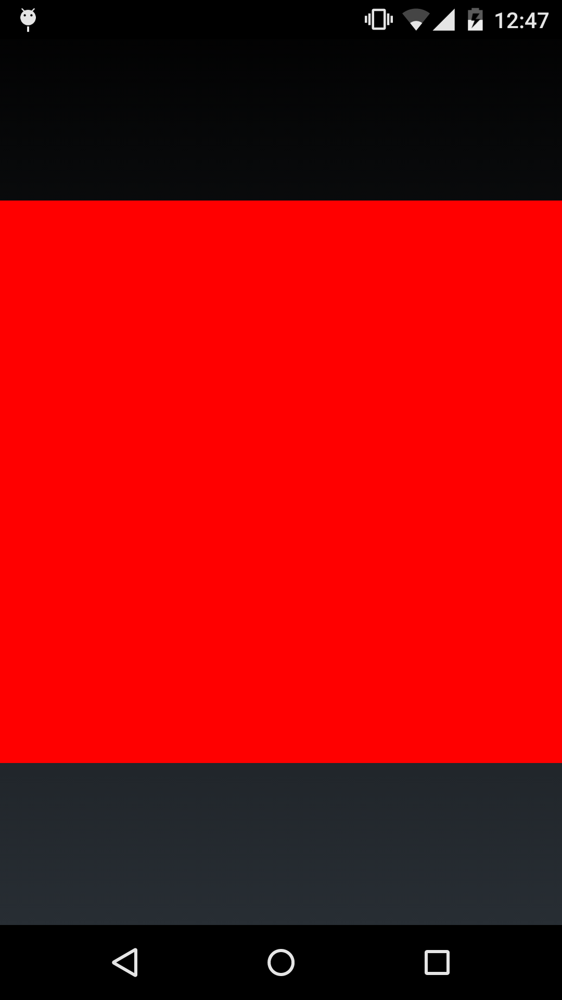

Daltonic
========

It is a very simple Android app that show the daltonism of the Android framework.


Code
----
```
	@Override
	protected void onCreate(Bundle savedInstanceState) {
		super.onCreate(savedInstanceState);
		
		Bitmap bmp = Bitmap.createBitmap(100, 100, Config.ARGB_8888);

		IntBuffer buffer = IntBuffer.allocate(bmp.getWidth() * bmp.getHeight());
	    buffer.rewind();
	    
	    while ( buffer.position() < buffer.limit() ) {
	    	buffer.put( Color.BLUE );
	    }
	    
	    buffer.rewind();
	    bmp.copyPixelsFromBuffer(buffer);
	    
	    ImageView view = new ImageView(this);
	    view.setImageBitmap(bmp);
	    
	    setContentView(view);
	}
```

Capture
-------


